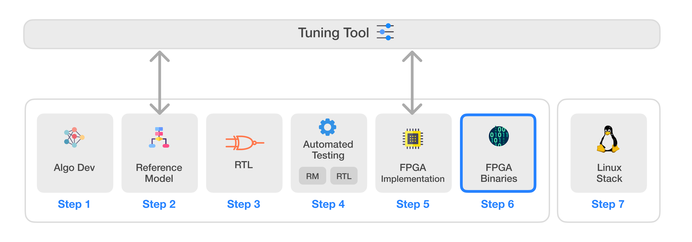

# Infinite-ISP
Infinite-ISP is a full-stack ISP development platform designed for all aspects of a hardware ISP. It includes a collection of camera pipeline modules written in Python, a fixed-point reference model, an optimized RTL design, an FPGA integration framework and its associated firmware ready for Xilinx® Kria KV260 development board and Efinix® Titanium Ti180 J484 Development Kit. The platform features a stand-alone Python-based Tuning Tool that allows tuning of ISP parameters for different sensors and applications. Finally, it also offers a software solution for Linux by providing required drivers and a custom application development stack to bring Infinite-ISP to the Linux platforms.




| Sr.     | Repository name        | Description      | 
|---------| -------------  | ------------- |
| 1  | **[Infinite-ISP_AlgorithmDesign](https://github.com/10x-Engineers/Infinite-ISP)**   | Python based model of the Infinite-ISP pipeline for algorithm development |
| 2  | **[Infinite-ISP_ReferenceModel](https://github.com/10x-Engineers/Infinite-ISP_ReferenceModel)**                      | Python based fixed-point model of the Infinite-ISP pipeline for hardware implementation |
| 3  | **[Infinite-ISP_RTL](https://github.com/10x-Engineers/Infinite-ISP_RTL)**  | RTL Verilog design of the image signal processor based on the Reference Model |
| 4  | **[Infinite-ISP_AutomatedTesting](https://github.com/10x-Engineers/Infinite-ISP_AutomatedTesting)**   | A framework to enable the automated block and multi-block level testing of the image signal processor to ensure a bit accurate design |
| 5  | **FPGA Implementation** | FPGA implementation of Infinite-ISP on <br>  <ul><li>Xilinx® Kria KV260’s XCK26 Zynq UltraScale + MPSoC **[Infinite-ISP_FPGA_XCK26](https://github.com/10x-Engineers/Infinite-ISP_FPGA_XCK26)** </li></ul>   |
| 6  | **[Infinite-ISP_FPGABinaries](https://github.com/10x-Engineers/Infinite-ISP_FPGABinaries)**  :anchor: | FPGA binaries (bitstream + firmware executable) for the Xilinx® Kria KV260’s XCK26 Zynq UltraScale + MPSoC and Efinix® Titanium Ti180 J484 Development Kit|
| 7  | **[Infinite-ISP_TuningTool](https://github.com/10x-Engineers/Infinite-ISP_TuningTool)**                              | Collection of calibration and analysis tools for the Infinite-ISP |
| 8  | **[Infinite-ISP_LinuxCameraStack](https://github.com/10x-Engineers/Infinite-ISP_LinuxCameraStack.git)** | Extending Linux support to Infinite-ISP and the developement of Linux-based camera application stack |

**[Request Access](https://docs.google.com/forms/d/e/1FAIpQLSfOIldU_Gx5h1yQEHjGbazcUu0tUbZBe0h9IrGcGljC5b4I-g/viewform?usp=sharing)** to **Infinite-ISP_RTL, Infinite-ISP_AutomatedTesting** and **Infinite-ISP_FPGA_XCK26** repositories


# Infinite-ISP FPGA Binaries
Infinite-ISP Image Signal Processing Pipeline FPGA binaries for [Xilinx® Kria™ KV260 Vision AI Starter Kit](./binaries/xilinx_xck26) and [Efinix® Titanium Ti180 J484 Development Kit](./binaries/efinix_ti180). Each binary file includes an FPGA bitstream paired with its firmware executable.

## Directory Structure

- The directory structure of the repo is as follows
```plaintext
Main Directory(Infinite-ISP_FPGABinaries)
│
├── binaries
│   ├── xilinx_xck26
│   └── efinix_ti180
│         
│
├── doc
│   ├── xilinx_xck26
│   ├── efinix_ti180
│   ├── assets
│   └── user_guide
│  
│   
├── scripts
    ├── xilinx_xck26
    └── efinix_ti180
```
* **binaries** contain the binary files for Xilinx® Kria™ KV260 Vision AI Starter Kit and Efinix® Titanium Ti180 J484 Development Kit.
* **doc** contain the User Guide and Configuration Menu.
* **scripts** contain the python scripts for files conversion.

## License 
This project is licensed under Apache 2.0 (see [LICENSE](LICENSE) file).

## Contact
For any inquiries or feedback, feel free to reach out.

Email: isp@10xengineers.ai

Website: http://www.10xengineers.ai

LinkedIn: https://www.linkedin.com/company/10x-engineers/
