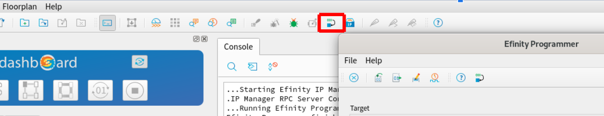
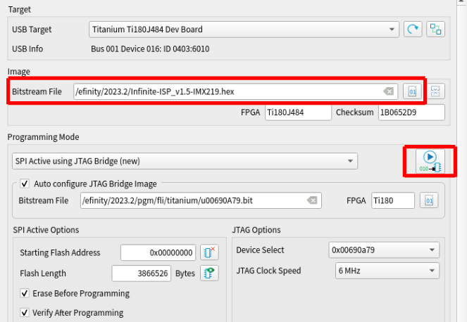

# How to use the Titanium Ti180 J484 Binary File

## v1.5
### Pre-requisite
- Efinity 2023.2 or latest version
- Efinix Titanium Ti180 J484 Development Kit

### For IMX219 image sensor module:
#### (Raspberry Pi Camera Module v2 or other compatible IMX219 image sensor module)
1. Connect the IMX219 image sensor module to the P1 connector on the Titanium Ti180 J484 Development Kit.
2. Insert an SD Card (2GB or above) into the Titanium Ti180 board.
3. Connect the Titanium Ti180 board with a monitor screen using an HDMI cable.
4. Power up the Titanium Ti180 board and follow the steps below.
    - Open Efinity Programmer
    
    - Change Programming Mode to `SPI Active using JTAG Bridge (New)`
    
    - Update bitstream file path to program `Infinite-ISP_v1.5-IMX219.hex` binaries and press start program button
    
5. Reset the Titanium Ti180 board by turning it OFF and then ON and visualize the Infinite-ISP output on your monitor screen.
6. Connect the USB cable with the JTAG/USB port on Titanium Ti180 to read the messages over the serial interface (baud rate 115200).
7. A configuration menu as shown below will appear. Details of the user menu are provided in the [user guide](https://github.com/10x-Engineers/Infinite-ISP_FPGABinaries/blob/main/doc/efinix_ti180/Infinite-ISP%20Configuration%20Menu.md)

<kbd></kbd> 

8. If you want to dump RAW10/RGB Pair, do so by going to option 3, and then you can remove the SD card from the Titanium board.

9. Extract the dumped RAW10/RGB Pair from the SD card and visualize them using the provided [scripts](../../scripts/efinix_ti180).

## Scripts for visualization of FPGA outputs in SD Card
| Name | Description |
| -----| ----- |
| [sd_reader_raw_ispout_pair.sh](../../scripts/efinix_ti180/sd_reader_raw_ispout_pair.sh) | extract the image sensor memory dump data from the SD Card. |
| [efinix_rgb_conversion.py](../../scripts/efinix_ti180/efinix_rgb_conversion.py) | converts the RGB output memory dump (.bin) data from the FPGA Platform to output image frame (.png) as well as output pixel data frame (.bin) for verification. |
| [efinix_raw_conversion.py](../../scripts/efinix_ti180/efinix_raw_conversion.py) | converts the image sensor memory dump (.bin) of RAW Burst Capture from the FPGA Platform to Bayer RAW frames (.raw) containing valid pixel data. |